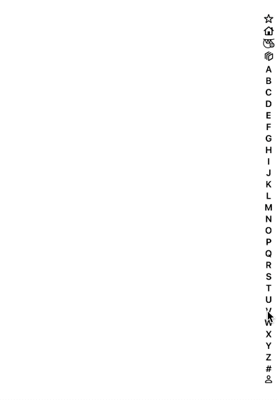

# 📖 TableOfContentsSelector



Are you familiar with `UITableView`'s `sectionIndexTitles` API? The little alphabet on the side of some tables for quickly jumping to sections.

This is a view very similar to that (very little in the way of originality here, folks) but offers a few nice changes I was looking for, so I thought I'd open source it in case anyone else wanted it too.

# Benefits

The [UITableView API](https://www.appcoda.com/ios-programming-index-list-uitableview/) is great, and you should try to stick with built-in components when you can avoid adding in unnecessary dependencies. That being said, here are the advantages this brought me:

- 🐇 Symbols support! SF Symbols are so pretty, and sometimes a section in your table doesn't map nicely to a letter. Maybe you have some quick actions that you could represent with a lightning bolt or bunny!
- 🌠 Optional overlay support. I really liked on my old iPod nano how when you scrolled really quickly an a big overlay jumped up with the current alphabetical section you were in so you could quickly see where you were. Well, added!
- 🖐 Delayed gesture activation to reduce gesture conflict. For my app, an issue I had was that I had an optional swipe gesture that could occur from the right side of the screen. Whenever a user activated that gesture, it would also activate the section index titles and jump everywhere. This view requires the user long-press it to begin interacting. No conflicts!
- 🏛 Not tied to sections. If you have a less straight forward data structure for your table, where maybe you want to be able to jump to multiple specific items within a section, this doesn't require every index to be a section. Just respond to the delegate and you can do whatever you want.
- 🏓 Not tied to tables. Heck, you don't even have to use this with tables at all. If you want to overlay it in the middle of a `UIImageView` and each index screams a different Celine Dion song, go for it.
- 🏂 Let's be honest, a slightly better name. The Apple engineers created a beautiful API but I can never remember what it's called to Google. `sectionIndexTitles` doesn't roll off the tongue. 
- 🌝 Haha moon emoji

# How to Install

No package managers here. Just drag and drop `TableOfContentsSelector.swift` into your Xcode project. You own this code now. You have to [raise it as your own](https://i.imgur.com/LqdUwQq.jpg).

# How to Use

Create your view.

```swift
let tableOfContentsSelector = TableOfContentsSelector()
```

(Optional: set a font. Supports increasing and decreasing font for accessibility purposes)

```swift
tableOfContentsSelector.font = UIFont.systemFont(ofSize: 12.0, weight: .semibold) // Default
```

The table of contents needs to know the height it's working with in order to lay itself out properly, so let it know what it should be

```swift
tableOfContentsSelector.frame.size.height = view.bounds.height
```

Set up your items. The items in the model are represented by the `TableOfContentsItem` enum, which supports either a letter (`.letter("A")`) case or a symbol case (`.symbol(name: "symbol-sloth", isCustom: true)`), which can also be a [custom SF Symbol](https://developer.apple.com/documentation/xcode/creating_custom_symbol_images_for_your_app) that you created yourself and imported into your project. As a helper, there's a variable called `TableOfContentsSelector.alphanumericItems` that supplies A-Z plus # just as the UITableView API does.

```swift
let tableOfContentsItems: [TableOfContentsItem] = [
    .symbol(name: "star", isCustom: false),
    .symbol(name: "house", isCustom: false),
    .symbol(name: "symbol-sloth", isCustom: true)
    ] 
    + TableOfContentsSelector.alphanumericItems

tableOfContentsSelector.updateWithItems(tableOfContentsItems)
```

At this point add it to your subview and position it how you see fit. You can use `sizeThatFits` to get the proper width as well.

Lastly, implement the delegate methods so you can find out what's going on.

```swift
func viewToShowOverlayIn() -> UIView? {
    return self.view
}

func selectedItem(_ item: TableOfContentsItem) {
    // You probably want to do something with the selection! :D
}

func beganSelection() {}
func endedSelection() {}
```

# License

MIT
